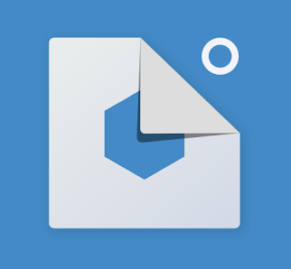
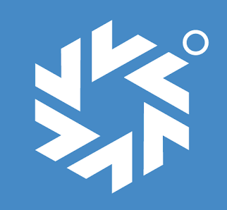

# 소개

  

전자입찰 분석,모빌러티 , IOT 분야에서 android를 개발한 경험이 있습니다  
발전하는 좋은 개발자가 되기 위해서는 새로운 기술에 두려움을 갖지 않고,  
다양한 직군의 사람과 협업을 해야 한다고 생각합니다.  
또한 가치 있는 코드를 작성하고 좋은 프로젝트에 참여하고 싶습니다.  

- 박찬호

- Email: chan33344@gmail.com

- GitHub: https://github.com/chanhoDev 

- blog: https://blog.naver.com/chan33344

## 개발 기술 요약 

<code>사용 툴</code> 
- Google Analytics 를 이용해 서비스 되고 있는 어플의 상태를 확인합니다. 
- 프로젝트에 대한 버전관리는 git 을 이용합니다.
- 디자이너와 협업을 위해 Slack으로 대화를 하며 Zeplin을 이용해 디자인을 받습니다.
- jetBrain 을 이용해 web,android 를 개발하는데 사용합니다. 

<code>AOS(android) 관련 개발 기술</code>
- Java ,Kotlin
- Retrofit2.0, RxAndroid
- Koin ,Hilt 
- RxJava
- Lottie
- FireBase(FCM, Crashlytics)
- MVVM , MVP, Respository 패턴 
- DataBinding
- CustomView
- Glide
- Room

<code>iOS 관련 개발 기술</code>
- Swift
- RxSwft
- MVVM 패턴
- without storyboard 방식
- FireBase(FCM)
- alamofire
- rxcocoa 

<code>공통 기술</code>
- Restful API  
- mysql
- angularjs 
- nodejs
- springboot

<code>CI/CD 관련 기술</code>
- Jenkins (AOS, iOS) 배포 

# 경력
### <a href="http://www.sysofting.co.kr/views/main.html">SYSOFT</a>  
- 부서: 솔루션 개발 App 팀
- 직책: 주임
- 기간 :<code>sysoft, 2019.06.03 ~ 현재</code>

### SYSOFT 프로젝트 
<code>[2021/6/1 ~ 현재][인원 4명][진행중]컨설팅 반응형 WEB 개발</code>
- angularjs, nodejs 이용한 반응형 웹 개발 

<code>[2021/4/22 ~ 2021/6/1][인원1명][완료]컨설팅 12개사 iOS 웹앱 개발 </code>
- sysoft 회사 조직 개발자 프로그램 아이디 생성및 계정 등록
- fcm 푸시알림, 인트로, 로그인, 메인웹뷰 개발(로그인 로그아웃 관련 토큰 브릿지 추가) 
- alamofire, rxswift, rxcocoa 라이브러리 조사 및 적용 
- mvvm 디자인 패턴, without storyboard 방식 적용
- jenkins + fastlane 이용한 자동 배포 작업
- Apple App Store 배포 

<code>[2021/2/28 ~ 2021/4/23][인원3명][완료]컨설팅 AOS 리팩토링 </code>
- 의존성 주입 koin 추가
- 공통 코드 정리
- 그래들 환경설정 개선(네이버아이디, 버전코드등)
- 구글 권고사항에 따른 개인정보 처리방침, 웹뷰 보안 취약점 관한 추가
- 배치 알림 조건 사업부별 정리 

<code>[2020/12/7 ~ 2020/12/24][인원3명][완료]컨설팅 심사서류/자금조달 현황 AOS 개발</code>
- 서비스 약관동의, 대표자 휴대폰인증, 대표자 문서로인증, 서류 다운로드 업로드 및 서류 제출 개발 

<code>[2020/10/12 ~2020/11/20][인원3명][완료]인트라넷 AOS 개발 <a href="https://play.google.com/store/apps/details?id=com.sysoft.intranet">SY 인트라넷 </a> </code>
- 인트로, 로그인. 맥등록, 홈, 결제정보, 수신참조 및 검토자 개발, 문서필터, 폼검색 기능 , 조회기간 개발 
- 배치 결제요청 히스토리 입력 개발 

<code>[2020/6/22~2020/10/23][인원1명][완료] 인트라넷 php -> Java Spring Rest API 개발</code>
- api 개발 (사원정보, 문서목록, 홈, 메인, 보고서내용리스트, 문서양식, 보고서작성, 결제업데이트, 공유직원리스트 등... ) 

<code>[2020/3/19 ~ 2020/3/30][인원1명][완료] 비드펀딩 AOS 개발 </code>
- 반응형으로 웹앱 테스트 및 다운로드 , 인트로, 로그인 개발 

<code>[2020/2/26 ~ 2020/4/3][인원2명][완료] 컨설팅 AOS 결제센터 개발 </code>
- 결제센터, 상품수수료 결제, 결제내역추가, paygate 계좌이체, 신용카드 결제(bridge 추가) 개발

<code>[2020/1/9 ~ 2020/2/14][인원2명][완료] 컨설팅 AOS 채팅 개발</code>
- 채팅 테이블 설계
- 담당자 채팅 알림, 파일모아보기, 다운로드, 채팅방 리스트 개발 

<code>[2019/10/4 ~ 2019/12/24][인원2명][완료]컨설팅 10개 사업부 AOS 개발 <a href="https://play.google.com/store/apps/details?id=com.sysofting.jinbid">진비드</a> ,<a href="https://play.google.com/store/apps/details?id=com.sysofting.autobid">오토비드</a> </code>
- 진비드, 오토비드등 10개 사업부 홈 개발 
- 사업부별 firebase fcm 푸시알림 추가 및 개발 
- 젠킨스 로컬 배표환경 작업 
- 앱배포 관련 난독화 적용 
- 사업부별 푸시알림 수신 설정 기능 개발 
- google play console 배포 

<code>[2019/7/29 ~ 2019/8/20][인원2명][완료] 컨설팅 AOS 개발 </code>
- 인트로,로그인, 맥등록, 홈, 분석실, 마이페이지, 분석실상세, 푸시알림설정 개발 
- firebase 푸시알림 개발 
- google play console 배포 

<code>[2019/7/1 ~2019/7/31][인원2명][완료]관리자 AOS 개발 <a href="https://play.google.com/store/apps/details?id=com.sysoft.manager">SY 모바일 관리자 </a>  </code>
- 사업부별 매출현황, 팀실적현황, 1순위, 통합출근부, 인트로, 맥관리자, 로그인 개발 
- google play console 배포 

# 대외 활동 및 개인 프로젝트 

### IOT를 활용한 법인차량 관제 시스템
<code>삼성 SDS 멀티캠퍼스, 2019.01.02 ~ 2019.02.28</code>
- <a href="https://blog.naver.com/chan33344/221479792399">법인차량을 소유하고 있는 기업에게 범용적으로 적용 가능한 IOT기반 기업 차량용 관제 시스템 프로젝트</a>

#### 역할
- Web 서버, DB설계, 웹앱 ui ,android 통신 및 ui 설계

#### 개발
- REST API 개발 
- Android App 개발 
- JAVA,Javascript,Html5,Css
- MVC 패턴
- Retrofit2.0
- RxJava 

### AR 기술을 활용한 걸으면 돈주는 어플 개발 
<code>정보통신기술진흥원, 2018.06.25 ~2018.08.05</code>
- <a href="https://blog.naver.com/chan33344/221480026460"> AR 기술을 활용한 걸으면 돈주는 어플 프로젝트</a>

#### 역할
- Unity Engine을 이용한 AR모드 개발 

#### 개발
- Java, C#
- Android App 개발 
- Google GeoLocation
- Cudan Camera API
- Unity Engine

### 자동으로 식물을 관리하는 플랜트 시터
<code>한국발명진흥회, 2016.05.02 ~ 2016.05.28 </code>
- <a href="https://blog.naver.com/chan33344/221259397563">플랜트 시터 프로젝트</a>

#### 역할
- 원격으로 Orange Board 와 Bluetooth 통신하도록 Android App 개발 담당 

#### 개발 
- java, C/C++
- Android App 개발 
- BlueTooth 통신 

# 학력

** 강원대학교 컴퓨터정보통신공학과 졸업 (2011.03 ~ 2018.08)  
** 중동고등학교 졸업 (2006.03 ~ 2009.02) 

# 자격증 

** 정보처리기사(2018.05)

# 수상 경력

** 2018 년 산호세 대학 기술 대회 (3등) 
** 2017 대한기계학회 우수 발표 논문상 (우수상) 
** 2017 아르키메데스 (은상) 

